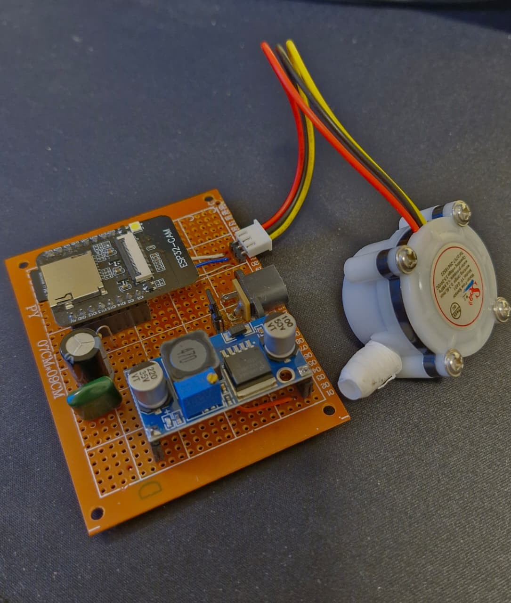
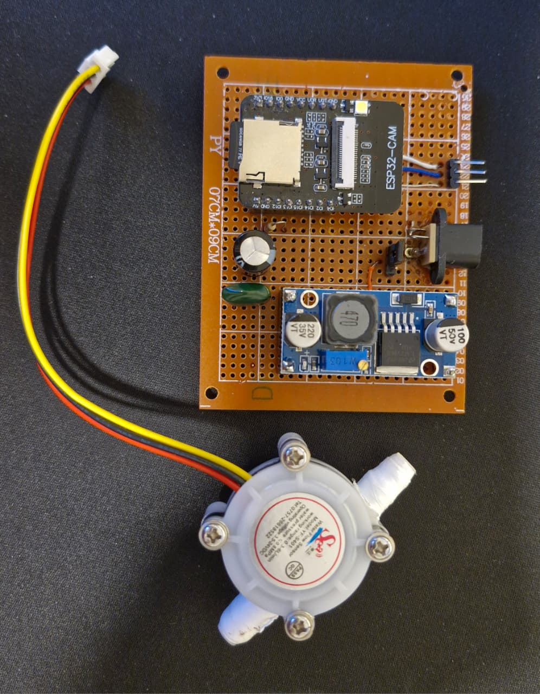
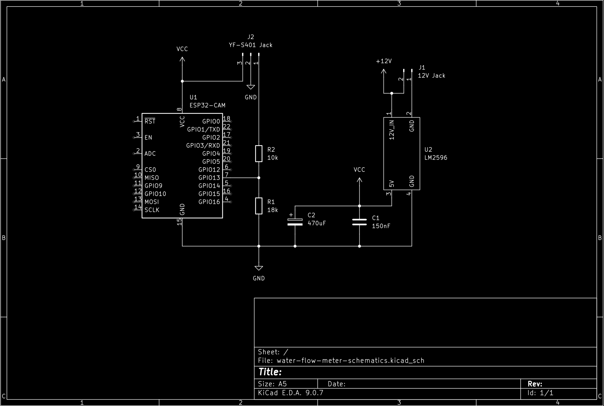

# Medidor de Flujo de Agua (ESP32-CAM + YF-S401)

Un sistema inalámbrico de monitoreo de flujo de agua basado en el sensor de flujo de efecto Hall YF-S401 y la placa AI-Thinker ESP32-CAM.

El sistema mide el flujo de agua detectando los pulsos generados por el sensor de efecto Hall a medida que el agua pasa a través del medidor. El ESP32-CAM procesa estos pulsos, calcula las mediciones de flujo y proporciona una interfaz web para monitorear el sistema y sus datos registrados.

El dispositivo está diseñado para su despliegue en entornos de campo abierto donde la conectividad a Internet puede no estar disponible. El ESP32-CAM opera como un Punto de Acceso (AP) Wi-Fi independiente y aloja la aplicación directamente en el dispositivo. Un portal cautivo presenta automáticamente la aplicación cuando un usuario se conecta a la red Wi-Fi del dispositivo, permitiendo configurar y monitorear el medidor de flujo desde un teléfono, tableta o computadora sin requerir acceso a Internet, infraestructura de red externa o servicios en la nube.

El hardware utiliza un convertidor reductor DC-DC LM2596 para regular el voltaje de entrada a los 5 V requeridos por el ESP32-CAM. El dispositivo admite una entrada de 12 V, lo que permite alimentarlo desde una batería compacta de 12 V o una batería de vehículo/automóvil, haciéndolo adecuado para despliegues autónomos en ubicaciones remotas donde las fuentes de energía convencionales pueden no estar disponibles.

## Hardware

- Placa: AI-Thinker ESP32-CAM
- Sensor de flujo: YF-S401
- Pin de pulso del sensor de flujo: GPIO13 (`FLOW_SENSOR_PIN`)
- Almacenamiento: Tarjeta microSD a través de `SD_MMC` en modo de 1 bit
- Almacenamiento del frontend: `LittleFS` (`data/index.html`)

<table>
    <tr>
        <td></td>
        <td></td>
    </tr>
</table> 

### Esquemático



Notas:

La señal de salida del YF-S401 se conecta a un divisor de voltaje formado por resistencias de 10 kΩ y 18 kΩ para reducir la tensión del sensor a un valor más cercano al rango lógico de 3.3 V requerido por la entrada del ESP32-CAM. La placa también incluye una pequeña red de estabilización de alimentación en la entrada principal de VCC: un capacitor electrolítico de 470 µF y un capacitor cerámico de 150 nF ubicados cerca de la entrada de la placa para absorber los picos de corriente generados por la radio Wi‑Fi y mantener la tensión estable durante los ráfagas de transmisión.


## Comportamiento actual del firmware

El firmware mide en ventanas fijas de 1 segundo:

- `MEASUREMENT_INTERVAL_MS = 1000`
- `HISTORY_INTERVAL_MS = 1000`
- `FLUSH_INTERVAL_MS = 10000`
- `PULSES_PER_MINUTE_SCALE = 60000 / 1000 = 60`

Cada ciclo de muestreo realiza lo siguiente:

1. Lee/reinicia de forma atómica el contador de pulsos de interrupción.
2. Convierte ese total de pulsos de 1 segundo en una tasa de flujo:
   - `pulses_per_minute = pulse_count * 60`
3. Actualiza el total acumulado `total_pulses`.
4. Almacena la muestra en un búfer en RAM y la vacía (flush) en la SD cada 10 segundos.
5. Actualiza el historial en vivo continuo utilizado por el panel de control.

El esquema CSV sigue siendo:

```csv
t_ms,pulse_count_10s,pulses_per_minute,total_pulses
```

El nombre del campo `pulse_count_10s` se conserva por compatibilidad con la versión anterior del proyecto, pero en la compilación actual representa los pulsos contados durante la última ventana de muestreo de 1 segundo.

Notas:

- La cámara no se inicializa intencionalmente para preservar el uso de los pines del sensor/SD.
- La entrada del sensor utiliza `INPUT_PULLUP` e interrupción en el flanco de subida (rising edge).
- Si el ruido de los pulsos causa un conteo excesivo, ajuste `MIN_PULSE_INTERVAL_US` en el firmware.
- El AP se llama `FlowMeter` con la contraseña `flowmeter123`.

## Conteo de pulsos basado en interrupciones

- La ISR (Rutina de Servicio de Interrupción) es intencionalmente mínima:
  - Lee `micros()`
  - Aplica el filtro de ruido/rebote `MIN_PULSE_INTERVAL_US`
  - Incrementa un contador de pulsos volátil
- En la ISR no se realiza trabajo pesado, acceso a SD, generación de JSON ni escrituras seriales.

## Registro en SD y manejo de archivos

- Se crea un nuevo archivo de registro cada vez que el dispositivo arranca, por ejemplo `/flow_log_0007.csv`.
- Un contador de arranque persistente (`/boot_seq.txt`) rastrea el siguiente índice de archivo a través de los reinicios.
- Las muestras sin procesar se almacenan en el búfer en RAM y se vacían en la SD cada 10 segundos.
- `/api/files` enumera todos los archivos de registro en la SD, los más nuevos primero, para que el panel de control pueda ofrecer un selector de archivos.
- `/api/history` y `/api/export.csv` aceptan un parámetro de consulta opcional `file` para inspeccionar o exportar una sesión anterior.
- La sesión actual se sirve desde el búfer en memoria y el estado del historial en vivo en lugar de volver a leer todo el archivo SD en cada sondeo.

## Comportamiento del panel de control (Dashboard)

El panel de control servido desde LittleFS proporciona tres tarjetas principales:

1. Flujo actual (`pulses/min`) a partir de la última muestra completada de 1 segundo.
2. Tiempo transcurrido desde el arranque (`HH:MM:SS`).
3. Total de pulsos desde el arranque, renderizados con sufijos SI como `k`, `M` y `B`.

### Captura de pantalla de la interfaz gráfica
<video controls autoplay loop muted playsinline>
  <source src="doc/gui_screenshot.mp4" type="video/mp4">
</video>

Gráfico histórico:

- Eje X: tiempo transcurrido desde el reinicio `t_ms`
- Eje Y: `pulses_per_minute`
- El gráfico en vivo mantiene una ventana móvil de 10 minutos para la sesión actual
- Los archivos históricos se muestran en su totalidad cuando se seleccionan en el menú desplegable
- El submuestreo determinista en el lado del frontend preserva los puntos inicial/final mientras reduce el número de puntos renderizados en historiales extensos

Comportamiento de sondeo (polling):

- Métricas actuales: cada 1 segundo
- Historial: cada 1 segundo
- Actualización de la lista de archivos: cada 15 segundos
- El tiempo transcurrido se actualiza cada segundo entre los sondeos para una experiencia de usuario más fluida

## API

### `GET /api/current`

Ejemplo:

```json
{
  "elapsed_ms": 123450,
  "pulse_count_10s": 15,
  "pulses_per_minute": 900,
  "total_pulses": 12345,
  "measurement_interval_ms": 1000,
  "has_measurement": true,
  "sd_ready": true,
  "current_file": "/flow_log_0007.csv"
}
```

### `GET /api/history`

La implementación actual devuelve muestras históricas sin procesar de 1 segundo, no bloques de 10 segundos.

Ejemplo:

```json
{
  "interval_ms": 1000,
  "measurement_interval_ms": 1000,
  "points": [
    { "t_ms": 1000, "pulses_per_minute": 60 },
    { "t_ms": 2000, "pulses_per_minute": 72 },
    { "t_ms": 3000, "pulses_per_minute": 84 }
  ]
}
```

Esta ruta acepta un parámetro de consulta opcional `file`, por ejemplo:

```text
/api/history?file=/flow_log_0003.csv
```

Cuando se solicita la sesión actual, el firmware utiliza una ruta rápida en memoria. Los archivos históricos se reproducen desde la SD cuando se selecciona un registro anterior.

### `GET /api/files`

Enumera los archivos de registro en la SD, los más recientes primero:

```json
{
  "files": [
    { "name": "/flow_log_0007.csv", "current": true },
    { "name": "/flow_log_0006.csv", "current": false }
  ],
  "current": "/flow_log_0007.csv"
}
```

### `GET /api/export.csv`

Exporta el historial de medición completo sin procesar para el archivo seleccionado o la sesión actual.

```csv
t_ms,pulse_count_10s,pulses_per_minute,total_pulses
```

Acepta un parámetro de consulta opcional `file` para exportar un archivo de registro específico en lugar de la sesión activa.

## Ejecución en hardware (PlatformIO)

La configuración del proyecto es `esp32cam` + framework Arduino + velocidad de monitor/carga de `115200` + LittleFS.

Desde la raíz del repositorio:

1. Compilar el firmware:

```bash
pio run
```

2. Cargar el firmware:

```bash
pio run --target upload --upload-port /dev/ttyUSB0
```

3. Cargar los archivos del panel de control a LittleFS:

```bash
pio run --target uploadfs --upload-port /dev/ttyUSB0
```

4. Abrir el monitor serial:

```bash
pio device monitor --port /dev/ttyUSB0 --baud 115200
```

Si la carga falla, coloque el ESP32-CAM en modo de flasheo (IO0 a GND o mantenga presionado el botón IO0 según lo requiera su adaptador) y vuelva a intentarlo.

## Acceso al panel de control en el dispositivo

- Conectarse al AP: `FlowMeter`
- Contraseña: `flowmeter123`
- Abrir el portal cautivo (o `http://10.0.0.1/`)

## Ejecución del simulador

El simulador expone el mismo contrato API y sirve la misma interfaz de usuario del panel de control.

Desde la raíz del repositorio:

```bash
pip install -r requirements.txt
uvicorn simulator.main:app --reload
```

Abra `http://127.0.0.1:8000/`.

Opciones útiles:

- Iniciar con un historial pregenerado largo:

```bash
SIM_INITIAL_MINUTES=5000 uvicorn simulator.main:app --reload
```

- Aleatoriedad reproducible:

```bash
SIM_RANDOM_SEED=123 uvicorn simulator.main:app --reload
```

Notas de simulación:

- El tiempo transcurrido aumenta continuamente.
- Las mediciones se generan cada 1 segundo.
- `pulses_per_minute` cambia dinámicamente con ruido y variaciones ocasionales.
- El simulador expone un archivo de registro sintético (`/flow_log_sim.csv`) para paridad de API con el firmware.
- El comportamiento del panel de control y la API reflejan de cerca la implementación del ESP32-CAM, incluida la selección de archivos y la exportación CSV.
